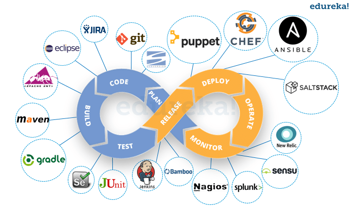

# Difference between Devops and SRE

| <h2>Dev</h2>           |       <h2>Ops</h2>        |
| ---                    |       ---                 |
| Agility                |       Stablity            |
| به فکر realse های جدید     | به فکر پایداری سیستم             |

### DevOps :
- [x] is a culture or movment not is a job roule.
- [x] is a practice like an interface.

### Devops practices:
- Total ownership  
    همه در یک جبه ایم نه جبه متفاوت 

- Failure is normal  
    خطا یک چیزی است که رخ میدهد و نرمال است

- Gradnal change  
    تغییرات باید به صورت تدریجی باشد  
    هزینه revert و change کمتر است 

- Automation    
    Code => deploy

- Containous management (Monitering)  
    سرویس باید به صورت مستمر پایش شود.

- Note :  it stated from plan
  
DevOps usually try to cover a life cycle. The DevOps engineer must be able to set tools for all parts.

### SRE : side reliablity Engineering

SRE unlike DevOps is a job roule.
SRE is a Implementation of DevOps